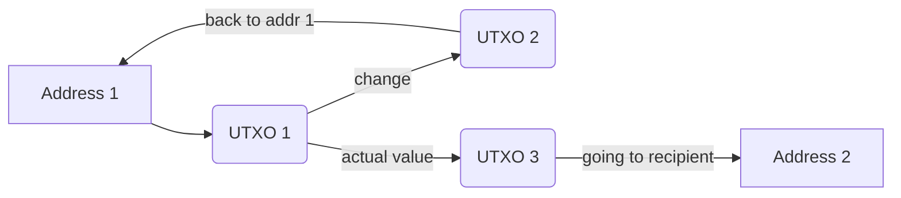

# Implementation of a cryptocurrency wth confidential transactions - learncoin
---
- [[#Introduction|Introduction]]
	- [[#Thesis goals|Thesis goals]]
	- [[#Document structure|Document structure]]
- [[#Brief history of cryptocurrencies|Brief history of cryptocurrencies]]
	- [[#Digicash|Digicash]]
	- [[#Bit-gold|Bit-gold]]
	- [[#Hashcash|Hashcash]]
	- [[#Ethereum|Ethereum]]
	- [[#Monero|Monero]]
- [[#Theoretical concepts|Theoretical concepts]]
	- [[#Zero knowledge proofs|Zero knowledge proofs]]
		- [[#Ali Baba cave example|Ali Baba cave example]]
	- [[#Elliptic curve cryptography (ECC)|Elliptic curve cryptography (ECC)]]
	- [[#Curve25519|Curve25519]]
	- [[#Cryptographic hash functions|Cryptographic hash functions]]
	- [[#Base58|Base58]]
- [[#Implementation|Implementation]]
	- [[#Cryptography|Cryptography]]
		- [[#Outline of goals|Outline of goals]]
			- [[#One-time confidential addresses|One-time confidential addresses]]
			- [[#Ring signatures|Ring signatures]]
				- [[#Generation|Generation]]
				- [[#Signature|Signature]]
				- [[#Verification|Verification]]
				- [[#Link check|Link check]]
- [[#Components design|Components design]]
	- [[#Chain|Chain]]
		- [[#Block|Block]]
		- [[#Header|Header]]
		- [[#Merkle Tree|Merkle Tree]]
			- [[#Computational complexity|Computational complexity]]
		- [[#Transactions|Transactions]]
		- [[#UTXO|UTXO]]
		- [[#Public key encoding|Public key encoding]]
	- [[#Peer-to-peer network|Peer-to-peer network]]
		- [[#Node|Node]]
- [[#Conclusions|Conclusions]]

---
## Introduction
### Thesis goals
The idea behind this thesis was to expand my practical knowledge in the field of the advanced cryptography implemented in coins that feature greater than normal transactional confidentiality such as Monero or Zcash. It ended up consisting of two separate parts: a basic p2p network and a cryptographic module allowing for fully confidential transactions with blinded receiver and sender using one-time addresses and ring signatures with key images.  The programming language chosen was Go. Main criteria were:
* Compilation speed for fast iteration
* Execution speed
* Portability of binaries
* Really good standard library for code in areas of computer networks
* Plethora of user submitted libraries (especially for [[#Elliptic curve cryptography ECC|ECC]])

### Document structure
This thesis can be roughly divided into 3 parts:
* First a [[#Brief history of cryptocurrencies|short summary of cryptocurrency history]] is presented to get the reader up to speed with this relatively new field of Computer Science. 
* Secondly [[#Theoretical concepts|theoretical explainers]]  for non-trivial algorithms and mathematical structures are introduced.
* Lastly design rationales related to the submitted code are presented along an explainer for the programs output.
At the very end some conclusions are presented with ideas of improvement and further development for the project.
---

## Brief history of cryptocurrencies
In this section I'd like to introduce a short history of concepts that came before Bitcoin and led to its creation, as well as showing some interesting developments that came afterwards.

The idea of digital cash had been broadly discussed by people in the Comp-sci field, especially the crypto-punk community, for the best part of the last 60 years. Various iterations and concepts were introduced and were slowly built upon. The invention of [[#Hashcash]] was a huge milestone and directly led to making the final step in this process (Satoshi quoted the algorithm as a solution to the notoriously hard problem of proof-of-work).
In 2009 Satoshi Nakamoto (pseudonym for an anonymous author) published the white-paper "Bitcoin: A Peer-to-Peer Electronic Cash System" which was the first real and working implementation of the concept later called cryptocurrency. It relied on [[#Elliptic curve cryptography ECC|ECC]] and `sha256` based proof-of-work, as well as some game theoretic concepts to allow users to perform completely decentralised and permissionless payments.
ref: http://satoshinakamoto.me/bitcoin.pdf
What came later was a true renaissance of digital cash systems with iterations cycles getting much faster each time. Different ledger technologies were proposed, the idea of proof-of-stake was conceived to reduce the energy impact of proof-of-work and multiple cryptographical breakthroughs were made to allow for faster and more private transactions. Below are listed by name the most important developments that came before and after Bitcoin. 

### Digicash
The first company implementing a "digital cash" system was probably Digicash founded in the late 80 by David Chaum. It promised to implement anonymous online payments, but failed because of the centralisation of its components. Nonetheless it introduced the concept of **blind signatures** which later got to be known as addresses in more recent cryptocurrencies.

### Bit-gold
Big-gold was an idea introduced by cryptographer Nick Szabo in 1998. It was the first real, decentralised, cryptographically sound digital cash concept which never got implemented. It introduced the concept of Proof-of-Work which was arguably it's biggest breakthrough. The project was so similar to Bitcoin that many suspected Satoshi Nakamoto to be Nick Szabo. He later denied those allegations.

### Hashcash
Hashcash is a proof-of-work algorithm invented by Adam Back in order to combat spam and DDoS attacks. It was used in the Bitcoin white-paper as the default algorithm for mining because of it's simplicity and elegance. Adam Back has been heavily involved in the development of Bitcoin since the very beginning through his company: Blockstream.

### Ethereum
Vitalik Buterin created Ethereum in 2015 after years of work with his close team. Ethereum is a cryptocurrency that implements a general purpose, Turing complete virtual machine inside its binary (the EVM). This allows much more complicated computation than Bitcoin, which introduced the concept of smart contracts: programs stored on the blockchain that execute code when given conditions are met. Use-cases for this involve decentralised currency-exchanges without third parties and non-fungible tokens.

### Monero
The origin of Monero (Esperanto for Coin) was a white-paper from 2013 called "CryptoNote v2" authored by Nicolas van Saberhagen - a fictional character. The original paper expanded on the ideas introduced by Satoshi Nakamoto by introducing confidential transactions. Monero built on those concepts with further research from academia, and is now the leading project in terms of privacy preserving e-cash systems along with Z-Cash.

---
## Theoretical concepts

### Zero knowledge proofs
A zero knowledge proof is a method by which one party can prove to another party that a statement is truthful while at the same time not disclosing any additional sensitive information (such as for example private keys or secret values). 
#### Ali Baba cave example
The Ali Baba cave is often quoted as a good explainer for the ideas behind ZKPs
Let's assume two characters: Alice and Bob. While on an adventure, they end up in a cave in which they find two distinct paths A and B. There is a door connecting both paths, to which Bob knows the code. Alice would like to purchase it from him, but first she wants to make sure he actually knows it.
In this situation it's clear that Bob is the proving party while Alice is the verifier. The proof will  work in the following fashion: Alice asks Bob to enter the cave without looking. She then asks him to exit the cave using one of the tunnels (A or B). If he knows the code to the door connecting the tunnels he'll use it and switch tunnels exiting by the one requested by Alice. Let's now assume he got lucky and entered through tunnel A, while being requested to also exit via this tunnel (there's a 50% change of this outcome!). Well we can conduct the test as many times as we want, reducing the probability of Bob being a cheat with each iteration.
This example nicely shows general principles behind zero-knowledge proofs: Alice won't know the code until she buys it and Bob doesn't have to provide any additional information to prove he knows it.


### Elliptic curve cryptography (ECC)
Elliptic curve cryptography is a variant of public-key cryptography schemes based on elliptic curves over finite fields. They provide stronger algebraical guarantees than systems based on prime number factorisation such as RSA, which allows for more intricate protocols. An elliptic curve is a plane curve described by the following equation $$ y^2 = f(x) $$ where $f(x)$ is a cubic polynomial with no repeated roots. We can now define a group structure on any smooth curve of this type, such that a point at infinity $O$ will serve as the identity of the group. The curve is symmetrical along the x-axis which means for a point $P$, $-P$ will be the exact opposite. Given 2 points $A, B$  let's draw a line that passes through both of them. We can now describe point $C$ as being at the intersection of the drawn line and the curve.
Let's define the operation $+$ in the following fashion $$ A + B = -C $$ a visual representation is shown below. 
![[Point-addition-on-an-elliptic-curve-defined-over-the-field-R.jpg]]
ref: https://www.researchgate.net/figure/Point-addition-on-an-elliptic-curve-defined-over-the-field-R_fig1_338648714
We can now define the operation $\cdot$ (multiplication) as repeated addition.
To define a cryptographic scheme over a curve we first have to agree on it's specific parameters, an example of which is shown for [[#Curve25519]] . After choosing a generator point we define a scalar value $x$ - the number of subsequent additions we'll perform. The discrete logarithm problem can be defined as follows:
Given $x$ it's trivial to perform the operation $$ P = xG $$ where $G$ is the generator point (every addition passes through it) and $P$ is the point at which we end up after performing repeated multiplication. On the other it is computationally infeasible to compute $x$ (given a large enough value for $x$) while only having $P, G$.
In summary: 
* We define $x$ - the number of repeated multiplications as our **private key**.
* We define $P$ - the resulting point as our **public key**.

### Curve25519
Is one of the fastest ECC curves, which reference implementation is public domain software. It's given with the formula: $$ y^2 = x^3 + 486663x^2+x $$ and is defined over the prime field defined by $2^{255}-19$. By design it accepts any 32-byte integer as a valid public key.


### Cryptographic hash functions
A cryptographic hash function is any function that maps arbitrarily sized data to a fixed-sized value. It guarantees that the transformation: $F(data) \rightarrow H$ is fast and $H$ is uniformly distributed in the hash function result space. At the same time $F'(H) \rightarrow data$ should be impossible to compute in any other way than brute-forcing every single possible combination.
Below are examples of inputs for various standardised cryptographic hash functions with their output presented as hex strings.
```
md5("the lazy dog jumps over the quick brown fox")    -> faf3071c93f0426384a6c20363c4ada1
sha1("the lazy dog jumps over the quick brown fox")   -> f2055aef1868865a131170dd1b9d99fba747cf56
sha256("the lazy dog jumps over the quick brown fox") -> cab3cf1fe52f03f75f698781825e0e7421c2d6bd4eac002e726aa04db0f1b9b1
```
It's important to note that since every `sha256` output contains 256 bits, each hash is also a valid `curve25519` public key.

### Base58
Base58 is a binary-to-text encoding design to reduce the ambiguity between letters in the resulting encoding (a flaw of base64). It's designed for human users manually reading and inputing data and as such is perfect for encoding cryptographic addresses.
Base58 alphabet: `123456789ABCDEFGHJKLMNPQRSTUVWXYZabcdefghijkmnopqrstuvwxyz`
Algorithm as pseudo-code:
```python
carry = 0
output = []
for byte in input:
	carry += byte*58 
	output.append(carry % 256)
	carry //= 256 # integer division
```


---
## Implementation
The goal of the project was to understand the inner workings of modern cryptocurrencies. Those can be divided into 2 distinct layers:

* ***A peer-to-peer networking layer, involving a consensus algorithm that's used to agree on a shared chain state.***
* ***A cryptographic layer allowing users to perform transactions, and exchange value.***

Even though they are distinct one cannot work without the other. This project ended up implementing both of those parts without joining them. The scope of such an endeavour would greatly exceed the workload of a typical engineering thesis and as such, has been left for potential future development. 


### Cryptography

#### Outline of goals
My goal with this component was to create a cryptographic scheme allowing for anonymous and untraceable exchange of value between addresses on the blockchain. The design was based on the paper *CryptoNote v2.0* by Nicolas van Saberhagen. The author of the paper set out to improve on the Bitcoin white-paper in various aspects, one of them being the cryptographic aspect of the cryptocurrency. Provided is analysis of flawed bitcoin privacy in academic papers:  ref: https://css.csail.mit.edu/6.858/2013/projects/jeffchan-exue-tanyaliu.pdf ref: https://arxiv.org/pdf/2002.06403.pdf  ref: https://arxiv.org/pdf/1502.01657.pdf
ref: https://www.bytecoin.org/old/whitepaper.pdf
Improvements can be roughly summarised into 2 components:
##### One-time confidential addresses
One major flow of Bitcoin is traceability of transactions. Without much care it's more than likely to receive two [UTXOs](#utxo) into one address, in effect linking them forever as going to one recipient. With careful statistical analysis of the transaction graph one could provably uncover someone's entire transactional history, which could be disastrous for private individuals and entities.

The author of the paper proposed a scheme which allows for non-interactive generation of one-time addresses. The scheme requires every user to generate 
* a private user key $(a,b)$
* a corresponding public user key $(A, B)$
subsequently publishing the public user key to allow for incoming transactions. Address generation proceeds as follows
* Sender [unpacks](#public-key-encoding) the provided public key pair $(A, B)$
```
lrn13FdrxyjAshFzkeZscWEEGnKxeX49bdgkbWKvv5gxHRo2gFg3YyLmEBtTTA7zunGiUBpXFkcJX6Sc7SvBkKbMmxjVeF7yTFXTNQe -> (98983851ace6e4f9be668784ed5ad9b799bb98df5ac50299ffb73a6c439428ba, 4976e98410e5bec273c75738aa15e9f1512aa492e03c2b5d39a15313a8c30fd8)
```
* Sender generates `r` a random *ed25519* scalar value and computes $P$  the one-time destination address. `sha256` hashes are valid *ed25519* scalars so we can perform regular curve operations (additions, multiplication, subtraction) with them
$$ P = sha256(rA)G+B$$
* Sender compute $R$ an *ed25519* point given by the equation $R = rG$  where $G$ is the generator point of *Ed25519* elliptic curve
* Sender sends the transaction to the one time address defined as `{P,R}`. 
* Receiver checks every incoming transaction with his private user key $(a,b)$ and computes $$ P' = sha256(aR)G+B $$
* If $P=P'$  it means this transaction is meant for the receiver. This works because $$ rA = raG = arG = aR $$
* The receiver is the only one who can recover $x$  the one-time private key corresponding to our one-time address $P$ $$ x = sha256(aR)+b $$ which means he can spend this output by using $x$ in a ring-signature verifying his ownership of this address

##### Ring signatures
While only using one-time addresses is great because it prevents address reuse it still allows allows constructing a deterministic transactional graph, which could be used for statistical analysis with sufficient accuracy. For that reason we introduce a second component for fully confidential transacting: ring signatures. Those allow to break the link between link and sender. As such the only public information left is the transaction amount. The generation of such a signature can be divided into 4 steps:

###### Generation
Sender chooses the private key $x$ for the UTXO he wants to spend and computes the corresponding public key $P = xG$. He also computes the key image $I = Hp(P)$, which will be used to prevent reusing the same $x$ in another transaction. $Hp$ is a deterministic, non necessarily cryptographically sound hash function that takes a *ed25519*  point and returns a *ed25519* point.
```go
func hashPointToScalar(point *edwards25519.Point) (*edwards25519.Scalar, error) {
	rBytes, err := crypto.HashData(point.Bytes())
	if err != nil {
		return nil, err
	}
	return edwards25519.NewScalar().SetBytesWithClamping(rBytes)
}

func HashPoint(p *edwards25519.Point) *edwards25519.Point {
	// Compute sha256 of point and convert it to scalar with clamping -> deterministic
	x, _ := hashPointToScalar(p)
	// Return xP where x = Hs(P)
	return edwards25519.NewIdentityPoint().ScalarMult(x, p)
}
func KeyImage(addr Address, dest OneTimeAddress) (x *edwards25519.Scalar, img *edwards25519.Point) {
	// Compute the txn private key x to use in the key image computation
	var err error
	if x, err = addr.ComputePrivateKey(dest); err != nil {
		panic(err)
	}
	img = new(edwards25519.Point).ScalarMult(x, HashPoint(dest.P))
	return
}
```

###### Signature
Sender generates a one-time ring signature of size $N$ with a non-interactive zero-knowledge proof. He selects a subset of [UTXOs](#utxo) with amounts SAME AS SYNONYM. He now has $N$ UTXOs each with a corresponding key $P_i$. He mixes his true [UTXO](#utxo) into the set of decoys $\{ P_i\ |\ i \in [0, N]\}$, where $P_s;\ s \in [0, N]$ is the real public key.
```go
func ShuffleAndAdd[T any](addition T, array []T) (pos int, res []T) {
	// Seed the random function
	rand.Seed(time.Now().UnixNano())
	// Shuffle incoming array to get more uniform txn distribution
	rand.Shuffle(len(array), func(i, j int) { array[i], array[j] = array[j], array[i] })
	// Randomly choose the position of the true txn
	pos = rand.Intn(len(array))

	// Add the txn to the required position in the array
	res = append(res, array[:pos]...)
	res = append(res, addition)
	res = append(res, array[pos:]...)
	return
}

truePos, txns := utility.ShuffleAndAdd(realTxn, decoyTxns)
```
He now picks random sets $\{q_i\ |\ i \in [0,N]\}$  and $\{w_i\ |\ i \in [0, N], w_s = 0\}$ each of valid *ed25519* scalars, and computes the sets $L_i, R_i$: $$ \{ L_i\ |\ L_i = q_i\cdot G + w_i\cdot P_i\},\ \{ Ri\ |\ R_i = q_i\cdot Hp(P_i)+w_i\cdot I \}$$
```go
q := make([]*edwards25519.Scalar, n)
	for i := 0; i < n; i++ {
		q[i], _ = randomScalar()
	}

	// No need for w_i where i == s; s -> our priv key
	w := make([]*edwards25519.Scalar, n)
	for i := 0; i < n; i++ {
		// Zero our the co-efficient for our key
		if i == truePos {
			w[i] = edwards25519.NewScalar()
		} else {
			w[i], _ = randomScalar()
		}
	}

	L := make([]*edwards25519.Point, n)
	for i := 0; i < n; i++ {
		// TODO: Check if multiplying by zero actually gives us the right result
		L[i] = new(edwards25519.Point).Add(
			new(edwards25519.Point).ScalarBaseMult(q[i]),
			new(edwards25519.Point).ScalarMult(w[i], txns[i].Keypair.P),
		)
	}
	R := make([]*edwards25519.Point, n)
	for i := 0; i < n; i++ {
		R[i] = new(edwards25519.Point).Add(
			new(edwards25519.Point).ScalarMult(q[i], HashPoint(txns[i].Keypair.P)),
			new(edwards25519.Point).ScalarMult(w[i], I),
		)
	}
```
Now using values we computed previously we compute the challenge $$ \gamma = sha256(m,L_1,...,L_n,R_1,...,R_n) $$
```go
// ComputeChallenge is used to compute c.
// c is used in computing the challenge for the real txn
// in the ring set
func ComputeChallenge(message []byte, L []*edwards25519.Point, R []*edwards25519.Point) (*edwards25519.Scalar, error) {
	var buffer bytes.Buffer

	// Write message (utxo in bytes representation) to buffer
	buffer.Write(message)

	// Write consecutive L_i to buffer
	for _, Li := range L {
		buffer.Write(Li.Bytes())
	}
	// Write consecutive R_i to buffer
	for _, Ri := range R {
		buffer.Write(Ri.Bytes())
	}

	// Calculate c = Hs(m, L_0, .., L_n, R_0, .., R_n)
	if hash, err := crypto.HashData(buffer.Bytes()); err != nil {
		return nil, err
	} else {
		return edwards25519.NewScalar().SetBytesWithClamping(hash)
	}
}
```
Finally we compute the response to our challenge: $$ \{\ c_i\ |\ c_i = w_i; i \neq s\ ||\ c_s = \gamma - \sum^n_{i=0}c_i \mod l; i = s\ \}$$ $$\{\ r_i\ |\ r_i = q_i;i \neq s\ ||\ r_i = q_s - c_s\cdot x \mod l; i = s\ \} $$
```go
// Compute the components for our response
	l := make([]*edwards25519.Scalar, n)
	// Prepare component to update sum as we compute consecutive values
	sumCi := edwards25519.NewScalar()

	for i := 0; i < n; i++ {
		// Skip computing for true utxo until we have every other
		if i != truePos {
			l[i] = w[i]
			sumCi = edwards25519.NewScalar().Add(sumCi, w[i])
		}
	}
	// Compute value for true utxo. Since the addition is modular it's unrecoverable
	l[truePos] = edwards25519.NewScalar().Subtract(c, sumCi)

	r := make([]*edwards25519.Scalar, n)
	for i := 0; i < n; i++ {
		if i == truePos {
			r[i] = edwards25519.NewScalar().Subtract(
				q[i],
				edwards25519.NewScalar().Multiply(l[i], x),
			)
		} else {
			r[i] = q[i]
		}
	}
```
The signature is then: $$ \sigma = (I, c_1,...,c_n,r_1,...,r_n)$$
```go
type RingSignature struct {
	// Utxos for which the ring sig is computed
	Utxos []Utxo
	// Key image in byte representation
	Image []byte
	// Challenges in byte representation
	C [][]byte
	// Responses in byte representation
	R [][]byte
}
```
###### Verification
The verifier performs the inverse transform to get $L'_i, R'_i$ values: $$ \{\ L'_i = r_i\cdot G + c_i\cdot P_i\ \}$$ $$ \{\ R'_i = r_i\cdot H_p(P_i)+c_i\cdot I \}$$

A final check is performed: $$ \sum^n_{i=0}c_i = sha256(m, L'_0,...,L'_n,R'_0,...,R'_n) \mod l $$
```go
func (ringSig RingSignature) CheckSignatureValidity(message []byte) bool {
	// Parse from byte values
	c, r, err := ringSig.CRToScalars()
	if err != nil {
		fmt.Println(err)
		return false
	}
	I, err := ringSig.ImageToPoint()
	if err != nil {
		fmt.Println(err)
		return false
	}
	// Prepare L, R arrays and scalar for sum of c values
	L, R := make([]*edwards25519.Point, len(c)), make([]*edwards25519.Point, len(c))
	sumCi := edwards25519.NewScalar()
	for i := 0; i < len(c); i++ {
		L[i] = edwards25519.NewIdentityPoint().Add(
			edwards25519.NewIdentityPoint().ScalarBaseMult(r[i]),
			edwards25519.NewIdentityPoint().ScalarMult(c[i], ringSig.Utxos[i].Keypair.P),
		)
		R[i] = edwards25519.NewIdentityPoint().Add(
			edwards25519.NewIdentityPoint().ScalarMult(r[i], HashPoint(ringSig.Utxos[i].Keypair.P)),
			edwards25519.NewIdentityPoint().ScalarMult(c[i], I),
		)
		sumCi = edwards25519.NewScalar().Add(sumCi, c[i])
	}

	challenge, err := ComputeChallenge(message, L, R)
	if err != nil {
		fmt.Println(err)
		return false
	}

	return challenge.Equal(sumCi) == 1
}
```
If this equality is correct that means the signer knows such a value $x$ that at least one $P_i = xG$.
###### Link check
The verifier checks in his set of used images that the key image $I$ hasn't been used before to prevent double spends. If this checks holds true he confirms the validity of the ring signature.

---
## Components design

### Chain
#### Block
The highest level container  of cryptographic structures in this project is a `Block`. Blocks serve as data structures that bunch together bundles of transactions, which allows for setting "checkpoints" for chain state. The structure definition is as follows:
```go
// Header is the header of a block
type Header struct {
	nonce        [8]byte
	version      uint8
	blockHash    crypto.Hash
	previousHash crypto.Hash
	merkleRoot   crypto.Hash
	time         time.Time
}

type Block struct {
	header       Header
	transactions crypto.MerkleTree
}
```
A block has two distinct components, a [`Header`](#header) and transactions stored in a [`Merkle Tree`](#merkle-tree). The field allowing for data continuity is `previousHash` which is the `SHA-256` hash of the previous block header. As the process of finding a block hash is very computationally intensive the deeper our block is inside the chain the harder it is to change its contents and switch the agreed upon consensus state.
```
|------------------|          |------------------|
|      ....        |          |      ....        |
|------------------|          |------------------|
| blockHash.       | -- |     | blockHash.       |
|------------------|    |     |------------------|
| previousHash.    |    | ----| previousHash.    |
|------------------|          |------------------|
```
#### Header
Header is a component of [`Block`](#block). It serves as a container for metadata (protocol version, time that block was created etc.). The Merkle Tree root is included which allows computing the `SHA-256` only for the header as opposed to the entire block (based on the cryptographic guarantees Merkle Trees give)
#### Merkle Tree
A Merkle Tree is a hash based tree-like data structure. It's a generalisation of the hash list. Each leaf is a piece of data, and non-leafs are hashes on their children. This gives strong integrity and verifiability guarantees ![[resources/merkle_tree.png]] ref: https://en.wikipedia.org/wiki/Merkle_tree#/media/File:Hash_Tree.svg
##### Computational complexity
Here's a table with computational complexity for Merkle Trees

|           | Average        | Worst          |
| --------- | -------------- | -------------- |
| Space     | $O(n)$         | $O(n)$         |
| Search    | $O(\log_2(n))$ | $O(\log_k(n))$ |
| Traversal | \*$O(n)$       | \*$O(n)$       |
| Insertion | $O(\log_2(n))$ | $O(\log_k(n))$ |
| Deletion  | $O(\log_2(n))$ | $O(\log_k(n))$ |
\* Amortized

ref: https://brilliant.org/wiki/merkle-tree/
```go
type Node struct {
	leaf    bool
	Hash    Hash
	Content *Hashable
}

type MerkleTree struct {
	nodes []Node
	depth uint
}
```
Here is the definition of a Merkle Tree in code. As it's essentially a binary tree I decided to opt for an array representation given the fact it is more concise and less allocation intensive when compared to a typical linked list-like approach
```go
// NewMerkleTree constructs a binary tree in which
// the leaves are transactions and parents are subsequent
// hashes. Since we know the depth at which the children will start
func NewMerkleTree(elements []Hashable) (*MerkleTree, error) {
	var pow float64
	elements, pow = fillElements(elements)
	// Tree size is sum(2^n for n from pow to 1)
	// so also 2^(n+1) - 1
	size := int(math.Pow(2, pow+1) - 1)
	tree := make([]Node, size)

	// Calculate the base index for level of leaves
	baseIndex := int(math.Pow(2, pow)) - 1
	// Fill all of the leaves with txs
	for i, element := range elements {
		hash, err := element.Hash()
		if err != nil {
			return nil, err
		}
		tree[baseIndex+i] = Node{leaf: true, Hash: hash, Content: &element}
	}
	// Fill all parent nodes until root
	for i := baseIndex - 1; i >= 0; i-- {
		childrenHash, err := HashData(append(tree[2*i+1].Hash, tree[2*i+2].Hash...))
		if err != nil {
			return nil, err
		}
		tree[i] = Node{leaf: false, Hash: childrenHash, Content: nil}
	}
	return &MerkleTree{tree, uint(baseIndex)}, nil
}
```
Since we can't guarantee that we'll have exactly $2^n$ elements we also need a function to fill out the $2^n -$ `elements` leafs left.
```go
// fillElements rounds the number of leafs to the nearest
// power of 2 greater than the length
func fillElements(el []Hashable) ([]Hashable, float64) {
	l := len(el)
	// Calculate the nearest power of two greater than the len of our tx list
	pow := math.Ceil(math.Log2(float64(l)))
	for i := 0; i < int(math.Pow(2, pow))-l; i++ {
		el = append(el, EmptyLeaf(0))
	}
	return el, pow
}
```
When we're ready to create a block we can retrieve the top hash and embed it into our block header
```go
func (m MerkleTree) RootHash() Hash {
	return m.nodes[0].Hash
}
```

#### Transactions
Transactions are the most important component of any cryptocurrency as they serve the purpose of transferring value between entities on chain. The [cryptography](#cryptography) behind them has been extensively discussed in its own section, so a short description of design reasoning will be provided.
```go
// Transaction represents a transaction in the learncoin network. It has one ring input and returns either a single output
// or the output and change back to the origin address
type Transaction struct {
	UtxosIn  []Utxo
	UtxosOut []Utxo
	To       OneTimeAddress
	Sigature RingSignature
}
```
While performing a valid transaction two situations can occur:
* Input value is equal to output value
* Input value is bigger than output value
The latter of which makes up the majority of cases. In such situation some change has to be returned to the sender. The logic for constructing a transaction has been shown below
```go
func (a Address) NewTransaction(utxosIn []Utxo, amount float32, to Address) Transaction {
	// Check if input amount == output amount.  If not we need
	// to generate change output to a new one time address generated
	// from our keys
	changeAmount := utxosIn[0].Amount - amount
	oneTimeTo, _ := to.NewDestinationAddress()

	// Create utxo out
	utxosOut := []Utxo{*NewUtxo(amount, oneTimeTo)}
	var changeUtxo *Utxo = nil
	if changeAmount != 0 {
		oneTimeChange, _ := a.NewDestinationAddress()
		changeUtxo = NewUtxo(changeAmount, oneTimeChange)
	}
	if changeUtxo != nil {
		utxosOut = append(utxosOut, *changeUtxo)
	}

	return Transaction{
		UtxosIn:  utxosIn,
		UtxosOut: utxosOut,
		To:       oneTimeTo,
		Sigature: RingSignature{},
	}
}
```

#### UTXO
A UTxO (Unspent Transaction Output) is the building block of all transactions. As the name suggests they contain value which can we further split into more UTXOs if need arises. Here's a diagram for a typical transaction with change

Each node in the network holds a set of all UTXOs with corresponding one time public keys, which they update with every new valid transaction.

#### Public key encoding
To facilitate exchanging keys between users I proposed an algorithm to encode public keys into human readable format. It can be defined as follows
* Create byte buffer - `buf` for computing output
* Take public key $(A,B)$
* Insert bytes of both public keys into `buf`
* Compute the `sha256` sum of `buf`
* Add the first 8 bytes to the end of `buf`
* Compute `base58` sum of given buffer for human readability
* Add lrn1 at the beginning of resulting string to further enhance readability
The decoding algorithm is defined as the inverse of this one. Example of encoding a key:
```
A = 13cdf09200021f90cb3ad6a695e5e01667f77d5ef0139660051e9271ca205eee
B = f93caf372e18a48040090c1581fcd5b355d592e6d5883b28b79075ece2a49f74

Encoded key: lrn1|HxMwT57Bbg79x2zHAS1AA9D9nZPNTMEWKXJ27kAaYdSPCeBtwnwH6fGJfYBDNQeYmHjUMRJjUXDgHMiS8xjQp8qaMuJWGhyK61
```

### Peer-to-peer network
#### Node
A node represents itself in the p2p network. Data type definition:
```go
type node struct {
	config config.NodeConfig
	logger log.Logger
	peers map[crypto.FixedHash]peer.Peer
}

type Address struct {
	Addr string
	Port string
}

type NodeConfig struct {
	// Connection vars
	addr     Address
	connType string
	// Protocol vars
	version string
	id      crypto.Hash
}
```
Each node in the network has a unique identity hash generated from the timestamp at which it was first started + a random seed:
```go
func generateNewIdentity() (crypto.Hash, error) {
	var d []byte
	nonce := make([]byte, 8)
	if d, err := time.Now().MarshalText(); err != nil {
		return d, err
	}
	binary.BigEndian.PutUint64(nonce, uint64(rand.Int63()))
	return crypto.HashData(append(nonce, d...))
}
```


## Conclusions
During the implementation process it became clear that while the general idea of cryptocurrencies is straightforward, there is a significant amount of intricacy related to the specific implementation of components. 
* Peer-to-peer networking turned out to be especially challenging because of the sheer number of edge cases related to synchronising known neighbours.
* From a cryptographic standpoint despite operations on `Curve25519` begin clearly defined in RFC 8032, each implementation has its own specific encoding for public keys (points on the curve). This turned out to be a challenge and led to multiple code refactors in the crypto module while trying to make the standard library cooperate with the `edwards25519` library. At the end the whole implementation ended up using `edwards25519` as the standard library design was so divergent from the RFC definition that they were unable to work together.